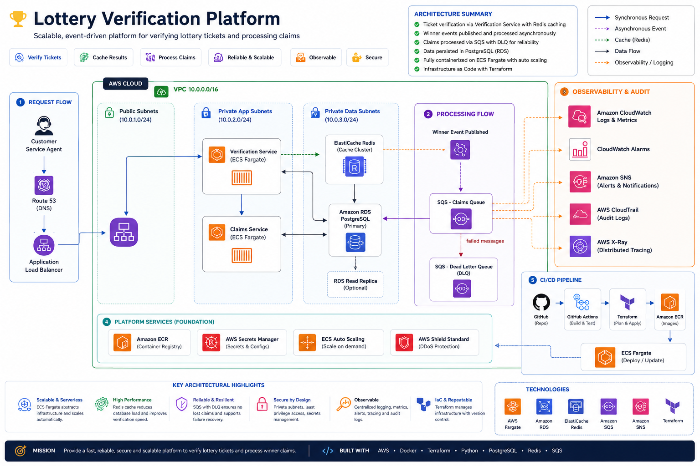

# Lottery Verification Platform on AWS

A production-style lottery ticket verification and claims registration platform deployed on AWS using **Terraform**, **ECS Fargate**, **Application Load Balancer**, **Amazon RDS PostgreSQL**, **AWS Secrets Manager**, **CloudWatch**, **CloudTrail**, **VPC Flow Logs**, **ALB access logs**, and **SNS**.

The platform allows an authorized customer service agent to:

- Verify lottery tickets by ticket number and draw date
- Check winning status and prize amount
- Register eligible winning tickets to claimants
- Prevent duplicate claim registration
- Generate claim confirmation with QR code
- Search registered claims by claimant name, ticket number, or claim ID

This project originated from a graduate cloud computing team project and has since been independently extended with additional cloud-native architecture, infrastructure, and operational enhancements.

---

## Table of Contents

- [Architecture](#architecture)
- [Key Design Decisions](#key-design-decisions)
- [Repository Structure](#repository-structure)
- [Logging and Monitoring](#logging-and-monitoring)
- [Cost Optimization and Cost Involvement](#cost-optimization-and-cost-involvement)
- [Known Issues and Limitations](#known-issues-and-limitations)
- [Troubleshooting](#troubleshooting)
- [Destroy / Cleanup](#destroy--cleanup)
- [Useful Commands](#useful-commands)

---

## Architecture



**Architecture flow:**

```text
Customer Service Agent
        |
        | HTTPS
        v
Application Load Balancer
(public subnets across 2 Availability Zones)
        |
        v
Amazon ECS Cluster on Fargate
(private app subnets)
   |                    |
   |                    |
verification-service    claims-service
   |                    |
   +---------+----------+
             |
             v
Amazon RDS PostgreSQL
(private DB subnets)
```

Supporting AWS services:

```text
Amazon ECR            → stores Docker images
AWS Secrets Manager   → stores DB credentials and DB host
CloudWatch Logs       → stores ECS application logs and VPC Flow Logs
CloudWatch Dashboard  → displays ECS, ALB, RDS, and app metrics
CloudWatch Alarms     → monitors CPU, memory, ALB 5XX, unhealthy targets, and RDS CPU
Amazon SNS            → sends CloudWatch alarm notifications
AWS CloudTrail        → captures AWS API activity
Amazon S3             → stores CloudTrail and ALB access logs
VPC Flow Logs         → captures network traffic metadata
```
---

## Repository Structure

```text
lottery-app/
├── claims-service/
├── verification-service/
└── deploy.sh

terraform/
├── provider.tf
├── variables.tf
├── main.tf
├── outputs.tf
├── terraform.tfvars              
├── certs/                       
│   ├── private.key
│   └── certificate.crt
└── modules/
    ├── acm/
    ├── alb/
    ├── db_security/
    ├── ecr/
    ├── ecs/
    ├── monitoring/
    ├── networking/
    └── security/
```

---

## Infrastructure

### Key Design Decisions

- ECS Fargate used instead of EC2
- Infrastructure provisioned using Terraform
- Dockerized Flask microservices
- Multi-AZ VPC deployment
- Public and private subnet separation
- NAT Gateway for private subnet internet access
- Application Load Balancer for traffic routing
- CloudWatch logging enabled
- ECR used as private Docker registry

---

### Why ECS Fargate Was Chosen

ECS Fargate was selected instead of traditional EC2 deployment for the following reasons:

### Advantages of ECS Fargate

- No EC2 server management
- Fully managed container orchestration
- Simplified scaling
- Better workload isolation
- Faster deployments
- Lower operational overhead
- Easier infrastructure management
- Native AWS integration with:
  - ALB
  - CloudWatch
  - IAM
  - ECR

### Why Not EC2 + Auto Scaling Groups?

Traditional EC2 deployments require:

- Server patching
- Capacity planning
- AMI management
- Manual scaling management
- EC2 provisioning and maintenance

Fargate abstracts the infrastructure layer entirely and allows developers to focus only on containers and services.

---

## Deployment Guide

To review the deployment steps and troubleshoot any issues while testing, please go to the [Guide](./docs/deployment_guide.md)

---
## Database Schema

The Lottery Verification Platform uses **PostgreSQL** as the relational database backend. The schema supports lottery ticket verification, winning claim registration, claimant tracking, QR confirmation, and authenticated customer service access.

The database is deployed using **Amazon RDS PostgreSQL** in private subnets, and application credentials are stored securely in **AWS Secrets Manager**.


### Schema Goals

The schema is designed to support:

- Lottery draw management
- Ticket verification
- Winning ticket status tracking
- Claimant registration
- Claim reference generation
- QR confirmation generation
- Claim search and tracking
- User authentication and authorization
- Duplicate claim prevention

---

### Entity Relationship Overview

```text
User
 └── registers ──► Claim
                        │
                        ▼
                    Claimant
                        │
                        ▼
                     Ticket
                        │
                        ▼
                      Draw
```

#### Security Considerations

The database and security design includes:

- Passwords are stored as hashes, not plaintext.
- Database credentials are managed using AWS Secrets Manager.
- ECS Fargate services retrieve database credentials at runtime.
- RDS PostgreSQL is deployed in private subnets.
- RDS is not publicly accessible.
- RDS encryption at rest is enabled.
- ECS services access RDS through security-group-restricted private networking.
- The RDS security group allows PostgreSQL traffic on port `5432` only from the ECS service security group.
- HTTPS/TLS is implemented through the Application Load Balancer.
- Amazon Shield Standard provides default DDoS protection for AWS services such as the Application Load Balancer.

---

#### Future Enhancements

Potential schema improvements include:

- Dedicated audit logging table for all user actions
- Claim approval and review workflow
- Fraud detection tracking
- Multi-region draw replication
- Ticket purchase history
- Payment processing integration
- User activity tracking
- Role-based access control with more granular permissions
- Claim document upload tracking
- Claim status history table

---

## Logging and Monitoring

The monitoring implementation is located in:

```text
terraform/modules/monitoring/
├── main.tf
├── variables.tf
└── outputs.tf
```

The platform includes:

- ECS application logs in CloudWatch Logs
- CloudWatch dashboard
- CloudWatch alarms
- SNS alarm topic and optional email subscription
- CloudTrail activity logging
- VPC Flow Logs
- ALB access logs stored in S3

---

## Cost Optimization and Cost Involvement

Approximate US East (N. Virginia / `us-east-1`) cost drivers:

| Resource | Cost involvement | Approximate impact if left running |
|---|---:|---|
| NAT Gateway | Charged hourly and per GB processed | About `$0.045/hour` = `$32.40/month` plus about `$0.045/GB` processed |
| Application Load Balancer | Charged per ALB-hour and LCU-hour | About `$0.0225/hour` = `$16.20/month`, plus LCU usage |
| ECS Fargate | Charged by vCPU-seconds and GB-seconds | For two small 0.25 vCPU / 0.5 GB tasks running 24/7: roughly `$18/month`; higher task sizes cost more |
| RDS PostgreSQL | Charged by DB instance hours, storage, and backups | Small demo instances are usually around `$12–13/month` plus storage/backups, depending on instance class |
| CloudWatch Logs | Charged by log ingestion and storage | Log ingestion can be around `$0.50/GB`; retention should be limited |
| CloudWatch Alarms | Charged per alarm metric | Standard alarms are about `$0.10/alarm/month`; 10 alarms ≈ `$1/month` |
| Secrets Manager | Charged per secret and API calls | About `$0.40/secret/month` plus API calls |
| ECR | Charged by image storage | About `$0.10/GB-month`; remove old images |
| S3 log buckets | Charged by storage and requests | Usually low for demo logs, but grows with CloudTrail/ALB log volume |
| CloudTrail | Management event history is available at no additional charge, but delivered trail logs use S3 storage | Keep one trail and avoid unnecessary extra event selectors for demo |

Cost-control choices in this project:

- Use ECS Fargate task sizes appropriate for a demo workload.
- Keep desired task count low during demonstration.
- Use CloudWatch log retention instead of unlimited retention.
- Use one NAT Gateway only for demo simplicity, then destroy it after submission.
- Store only required Docker images in ECR.
- Use S3 buckets for CloudTrail and ALB logs only as long as needed for evidence.
- Keep `enable_app_log_metric_filters = false` until log groups exist.
- Destroy infrastructure immediately after screenshots and submission.

Important cost warning:

> NAT Gateway, ALB, RDS, and Fargate continue charging while running. Do not leave the stack deployed after the project is complete.

---

## Known Issues and Limitations

### 1. Self-signed certificate browser warning

The project uses a self-signed/imported certificate for demo HTTPS. Browsers will show a security warning. For production, use a public ACM certificate with domain validation.

### 2. Application event metrics may show no data

The Application Events dashboard depends on exact log patterns:

```text
LOGIN_FAIL
CLAIM_REGISTERED
DUPLICATE_CLAIM_ATTEMPT
```

If the app does not emit these strings during the selected time range, the widget may show no data.

### 3. Metric filters should not be enabled too early

If `/ecs/verification-service` and `/ecs/claims-service` do not exist yet, CloudWatch metric filter creation can fail. Keep this false first:

```hcl
enable_app_log_metric_filters = false
```

Enable it only after ECS log groups exist.

### 4. ALB access logs and CloudTrail logs are delayed

ALB access logs and CloudTrail S3 log files can take several minutes to appear. Generate traffic and wait 5–15 minutes before collecting screenshots.

### 5. RDS free-tier backup restriction

Some AWS Academy/free-tier accounts reject certain backup retention settings. For demo deployment, backup retention may need to be reduced:

```hcl
backup_retention_period = 0
```

### 6. Secrets Manager recovery window

If the secret is deleted and then recreated with the same name, AWS may block creation because the old secret is scheduled for deletion. Restore or force-delete the old secret before reapplying.

---

## Final Result

The project demonstrates:

- Infrastructure as Code with Terraform
- Two containerized Flask microservices
- ECS Fargate deployment
- Public/private subnet architecture
- Application Load Balancer routing
- HTTPS/TLS through ACM-imported certificate
- PostgreSQL database on Amazon RDS
- Secure secret handling through AWS Secrets Manager
- Centralized logging through CloudWatch Logs
- CloudWatch dashboard and alarms
- CloudTrail audit logging
- VPC Flow Logs
- ALB access logging to S3
- SNS alarm notification support
- Cost-aware cleanup and retention practices
